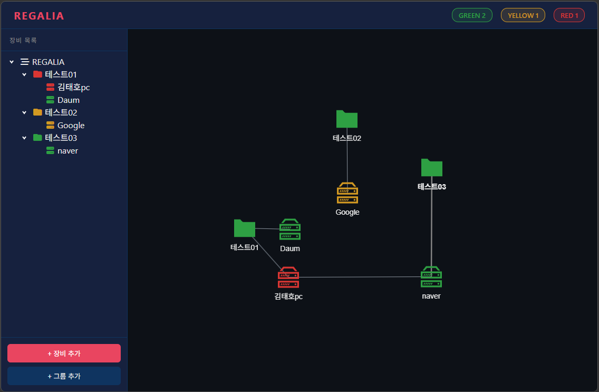
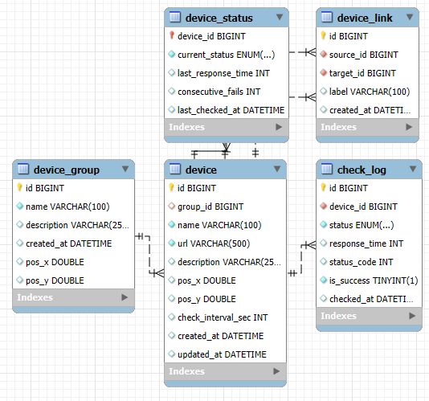
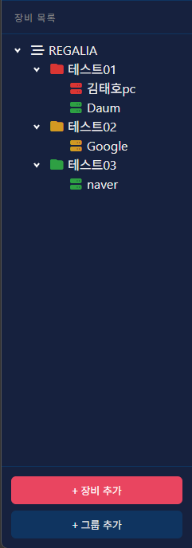
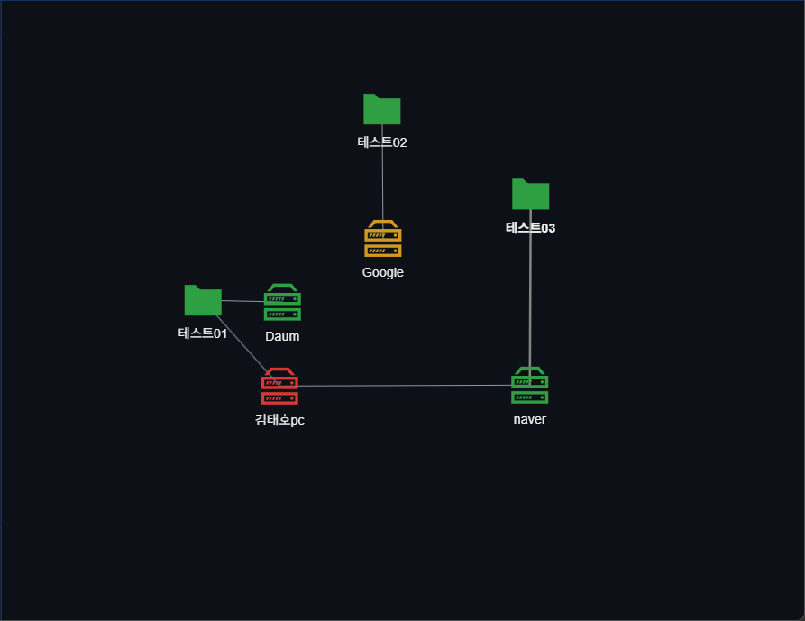
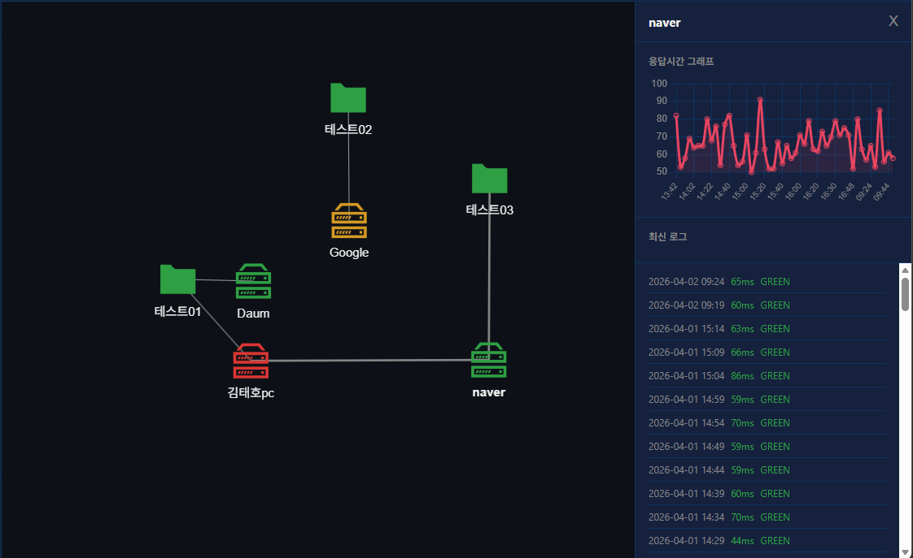

# 🖥️ Project Regalia - Mini NMS

> HTTP 기반 장비 상태를 5분 주기로 수집하고, 토폴로지로 시각화하여 장애를 직관적으로 파악하는 미니 NMS

<br>

## 📌 프로젝트 소개

**Regalia**는 서버, 네트워크 장비 등 모니터링 대상의 HTTP 응답 상태를 주기적으로 수집하고,  
토폴로지 형태로 시각화하여 장애를 직관적으로 파악할 수 있는 미니 NMS(Network Management System)입니다.



<br>

## ⚙️ 기술 스택

| 분류 | 기술 |
|------|------|
| Backend | Spring Boot 4.x, Spring Data JPA, Spring Scheduler |
| Database | MySQL 8.0 |
| Frontend | JSP, JavaScript, jQuery, jstree |
| Visualization | vis-network, Chart.js |
| Build | Maven |
| Version Control | Git, GitHub |

<br>

## 🗂️ 시스템 아키텍처

```
Browser (JSP + JavaScript)
        │
        │  REST API (fetch)
        ▼
Spring Boot (Controller → Service → Repository)
        │
        │  JPA
        ▼
    MySQL DB
        ▲
        │
Spring Scheduler (@Scheduled)
  └─ 5분마다 HTTP 상태 체크
  └─ check_log 저장
  └─ device_status 업데이트
```

<br>

## 📊 ERD



| 테이블 | 설명 |
|--------|------|
| device_group | 장비 그룹 정보 및 토폴로지 위치 |
| device | 모니터링 대상 장비 정보 및 토폴로지 위치 |
| device_link | 토폴로지 장비 간 연결 관계 |
| device_status | 장비 현재 상태 캐시 (GREEN/YELLOW/RED) |
| check_log | 상태 체크 이력 (30일 보관) |

<br>

## 🚦 상태 판정 기준

| 상태 | 조건 | 색상 |
|------|------|------|
| GREEN | 응답 성공 + 500ms 이하 | 🟢 |
| YELLOW | 응답 성공 + 500ms 초과 | 🟡 |
| RED | timeout 또는 연속 3회 이상 실패 | 🔴 |

<br>

## 🔧 주요 기능

### 1. 장비 트리
- 그룹/장비 CRUD (추가, 수정, 삭제)
- 드래그앤드롭으로 그룹 간 장비 이동
- 장비 상태에 따른 아이콘 색상 변경
- 하위 장비 상태에 따른 그룹 색상 연동



### 2. 토폴로지
- 장비/그룹 노드 자유 배치 및 위치 저장
- 노드 간 연결선 추가/삭제
- 노드 클릭 시 상세 패널 연동
- 5분마다 상태 자동 갱신



### 3. 상세 패널
- 응답시간 그래프 (Chart.js)
- 최신 체크 로그 목록



### 4. 스케줄러
- 비동기 스케줄링 기반 자동 상태 수집
- 5분마다 전체 장비 HTTP 상태 체크
- 응답시간, 상태코드, 성공여부 DB 저장
- 30일 지난 로그 자동 정리

<br>

## 📁 프로젝트 구조

```
src/main/java/com/example/regalia
├── controller      # REST API 엔드포인트
├── service         # 비즈니스 로직
├── repository      # DB 접근 계층 (Spring Data JPA)
├── entity          # JPA 엔티티
├── dto             # 데이터 전송 객체
└── scheduler       # 주기적 상태 체크

src/main/webapp
├── WEB-INF/views   # JSP 뷰
└── images          # 노드 아이콘 이미지

sql
└── schema.sql      # DB 스키마
```

<br>

## 🚀 실행 방법

### 1. DB 설정
```sql
CREATE DATABASE regalia DEFAULT CHARACTER SET utf8mb4 COLLATE utf8mb4_unicode_ci;
```
`sql/schema.sql` 실행하여 테이블 생성

### 2. application.properties 설정
```
application.properties.example 파일을 복사하여
application.properties 생성 후 DB 비밀번호 입력
```

### 3. 실행
```bash
mvn spring-boot:run
```
또는 STS에서 Run As → Spring Boot App

### 4. 접속
```
http://localhost:8080/
```

<br>

## 📝 API 명세

| Method | URL | 설명 |
|--------|-----|------|
| GET | /api/devices | 전체 장비 조회 |
| POST | /api/devices | 장비 등록 |
| PUT | /api/devices/{id} | 장비 수정 |
| DELETE | /api/devices/{id} | 장비 삭제 |
| PUT | /api/devices/{id}/position | 토폴로지 위치 저장 |
| GET | /api/groups | 전체 그룹 조회 |
| POST | /api/groups | 그룹 등록 |
| PUT | /api/groups/{id} | 그룹 수정 |
| DELETE | /api/groups/{id} | 그룹 삭제 |
| PUT | /api/groups/{id}/position | 토폴로지 위치 저장 |
| GET | /api/links | 전체 연결선 조회 |
| POST | /api/links | 연결선 등록 |
| DELETE | /api/links/{id} | 연결선 삭제 |
| GET | /api/tree | 트리 데이터 조회 |
| GET | /api/topology | 토폴로지 데이터 조회 |
| GET | /api/logs/{deviceId} | 장비별 로그 조회 |
| GET | /api/logs/{deviceId}/graph | 장비별 그래프용 로그 조회 |

<br>

## 🛠️ 트러블슈팅

### 1. JSON 순환 참조 문제
- **문제**: Entity 직렬화 시 `Device → DeviceGroup → Device` 무한 참조로 StackOverflow 발생
- **해결**: `@JsonIgnore`, `@JsonIgnoreProperties` 어노테이션으로 순환 참조 차단

### 2. Lombok 미인식 문제
- **문제**: STS에서 `@RequiredArgsConstructor` 등 Lombok 어노테이션 미인식
- **해결**: `SpringToolsForEclipse.ini`에 `-javaagent:lombok.jar` 추가 후 Project Clean

### 3. jstree 노드 색상 적용 문제
- **문제**: CSS로 색상 적용 시 기본 테마에 의해 덮어씌워짐
- **해결**: jstree 내부 모델 데이터(`_model.data`) 직접 순회하여 DOM에 색상 적용
